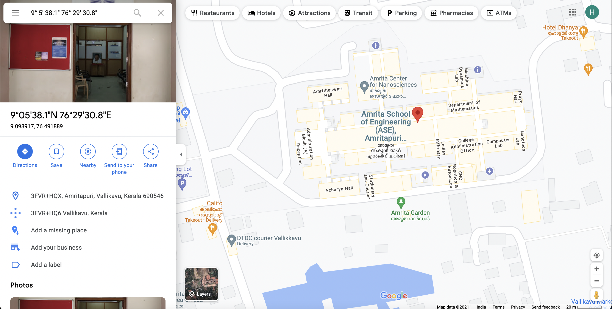

# Making Directories
For this I used mkdir directory name command in the terminal. 

# Moving into Directory
For this I used cd directory name command

# Creating a file
For this i used touch filename.txt command

#Writing into file
For this I used nano filename.txt command

#Combining files
For this I used cat filenameofsmallerfiles > newfile.txt

#Screenshot of location

# Uploading files
I used the github website's option to upload files directly.